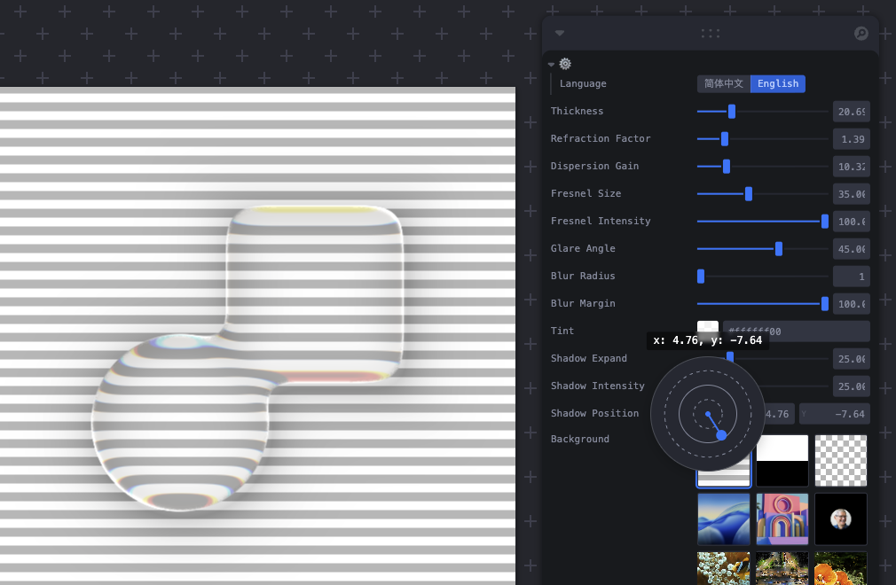
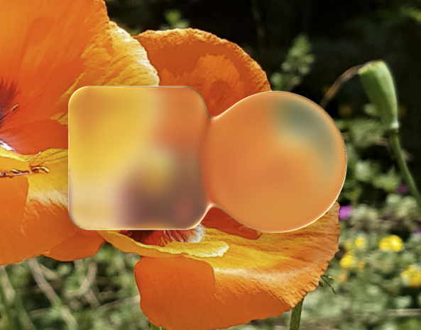
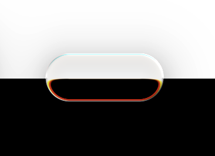
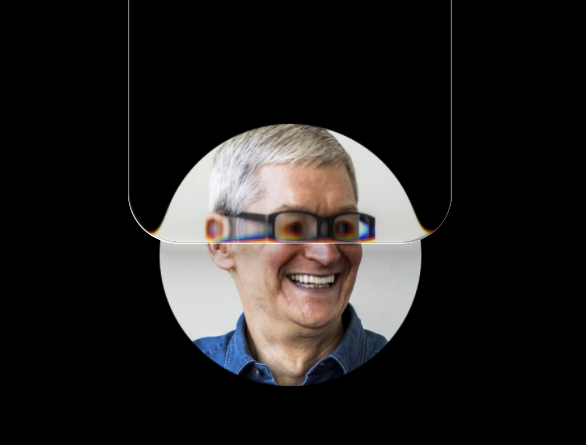

# 🔮 Liquid Glass Studio

[English](README.md) | [简体中文](README-zh.md)

The ultimate Apple Liquid Glass UI replica for the Web, powered by WebGL2 and shaders. Includes most Liquid Glass features with fine-grained controls for detailed customization.

<p align="center">

</p>

## Online Demo

https://liquid-glass-studio.vercel.app/

## ScreenShots

<table align="center">
  <tr>
    <td></td>
    <td></td>
  </tr>
  <tr>
    <td></td>
    <td></td>
  </tr>
</table>

## Features

- **Full features of Apple Liquid Glass Effects**:
  - Refraction
  - Dispersion
  - Fresnel reflection
  - SuperEllipse shape
  - Blob Effect (Shape Merge)
  - Glare
  - Gussian Blur Mask
  - Shadow
  - Self-illumination
  - Anti-aliasing
- **Interactive Controls**: Real-time parameter adjustments with intuitive UI
- **Background Options**: Multiple background types including images and videos
- **Animation Support**: Spring-based animations with configurable parameters

## Technical Highlights

- WebGL-based rendering for high-performance graphics
- Multipass rendering for high-quality & performant Gaussian blur
- Using SDF Defined shapes and smooth merge function
- Custom shader implementations for realistic glass effects
- Custom Leva UI components for intuitive parameter controls

## Getting Started

### Prerequisites

- Node.js (latest LTS version recommended)
- pnpm package manager

### Installation

```bash
# Install dependencies
pnpm install

# Start development server
pnpm dev

# Build for production
pnpm build
```

## TODO

- [ ] More Glare Controls (hardness / color / size etc.)
- [ ] Custom Background
- [ ] Self-illumination
- [ ] Control parameter import / export
- [ ] Render Step view to show intermediate results
- [ ] UI Content inside of shape

## License

[MIT License](LICENSE)
