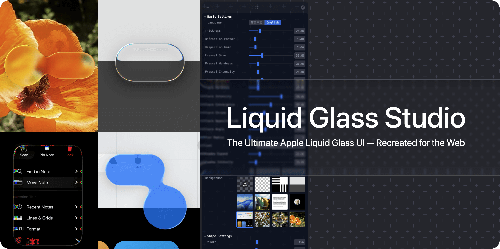

# 🔮 Liquid Glass Studio



[English](README.md) | [简体中文](README-zh.md)

The Ultimate Web Recreation of Apple’s Liquid Glass UI, powered by WebGL2 and shaders. Includes most Liquid Glass features with fine-grained controls for detailed customization.

## Online Demo

https://liquid-glass-studio.vercel.app/

For users in mainland China, please visit:  
https://liquid-glass.iyinchao.cn/

## ScreenShots

<table align="center">
  <tr>
    <td></td>
    <td></td>
    <td></td>
  </tr>
  <tr>
    <td></td>
    <td></td>
  </tr>
</table>

## Features

**✨ Apple Liquid Glass Effects:**

- Refraction
- Dispersion
- Fresnel reflection
- Superellipse shapes
- Blob effect (shape merging)
- Glare with customizable angle
- Gaussian blur masking
- Anti-aliasing

**⚙️ Interactive Controls:**

- Comprehensive real-time parameter adjustments via an intuitive UI

**🖼 Background Options:**

- Support for both images and videos as dynamic backgrounds

**🎞 Animation Support:**

- Spring-based shape animations with configurable behavior

## Technical Highlights

- WebGL-based rendering for high-performance graphics
- Multipass rendering for high-quality & performant Gaussian blur
- Using SDF Defined shapes and smooth merge function
- Custom shader implementations for realistic glass effects
- Custom Leva UI components for intuitive parameter controls

## Getting Started

### Prerequisites

- Node.js (latest LTS version recommended)
- pnpm package manager

### Installation

```bash
# Install dependencies
pnpm install

# Start development server
pnpm dev

# Build for production
pnpm build
```

## TODO

- [x] More Glare Controls (hardness / color / size etc.)
- [x] Custom Background
- [ ] Render with WebGPU
- [ ] Editor mode
- [ ] Glass Text Rendering
- [ ] Glass Presets
- [ ] Self-illumination
- [ ] HDR illumination
- [ ] Control parameter import / export
- [x] Render Step view to show intermediate results
- [ ] UI Content inside of shape

## Credits

Thanks to the following resources and inspirations:

- [SDF functions](https://iquilezles.org/articles/distfunctions2d/) and [smooth merge function](https://iquilezles.org/articles/smin/) by [Inigo Quilez](https://iquilezles.org/)
- Sample photo (Buildings) by <a href="https://unsplash.com/@anewevisual?utm_content=creditCopyText&utm_medium=referral&utm_source=unsplash">Adrian Newell</a> on <a href="https://unsplash.com/photos/a-row-of-multicolored-houses-on-a-street-UtfxJZ-uy5Q?utm_content=creditCopyText&utm_medium=referral&utm_source=unsplash">Unsplash</a>
- Sample video (Fish / Traffic) by Tom Fisk from [Pexels](https://www.pexels.com/video/light-city-road-traffic-4062991/)
- Sample video (Flower) by Pixabay from [Pexels](https://www.pexels.com/video/orange-flowers-856383/)
- Sample Photo by Apple and Tim Cook

## License

[MIT License](LICENSE)
